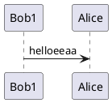
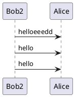

# Getting Started 1

### yyyy/mm/dd

---

```plantuml
@startuml
Bob1 -> Alice : helloeeaa
@enduml
```

```plantuml
@startuml
Bob2 -> Alice : helloeeedd
Bob2 -> Alice : hello
Bob2 -> Alice : hello
@enduml
```

---

The End.
