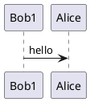
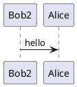
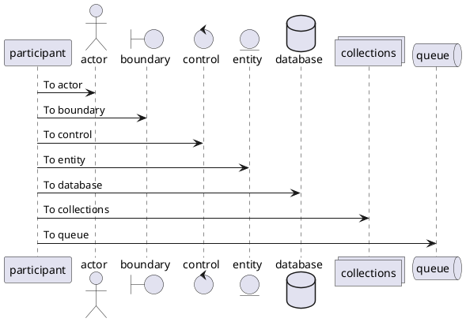

# Code Conversation

### 2021/4/9 Fri.

---







---

### サンプル見出し 〇〇な実装

概要説明

- ｘｘｘよりもｙｙｙ
- ｘｘｘよりもｙｙｙｓｓｓ
- ｘｘｘよりもｙｙｙえええっうぇｗｗ

```js
const func = () => {
  console.log("Hello World");
};

import React from "react";

export default function ProductRow(props) {
  const { categorizedProduct, keyword, isShowOnlyInStock } = props;
  const { name, price, stocked } = categorizedProduct;

  const isMatchedKeyword = !keyword || name.includes(keyword);
  const isShow = (stocked || !isShowOnlyInStock) && isMatchedKeyword;

  return (
    isShow && (
      <tr>
        <td style={stocked ? {} : { color: "red" }}>{name}</td>
        <td>{price}</td>
      </tr>
    )
  );
}

import React from "react";

export default function ProductRow(props) {
  const { categorizedProduct, keyword, isShowOnlyInStock } = props;
  const { name, price, stocked } = categorizedProduct;

  const isMatchedKeyword = !keyword || name.includes(keyword);
  const isShow = (stocked || !isShowOnlyInStock) && isMatchedKeyword;

  return (
    isShow && (
      <tr>
        <td style={stocked ? {} : { color: "red" }}>{name}</td>
        <td>{price}</td>
      </tr>
    )
  );
}

import React from "react";

export default function ProductRow(props) {
  const { categorizedProduct, keyword, isShowOnlyInStock } = props;
  const { name, price, stocked } = categorizedProduct;

  const isMatchedKeyword = !keyword || name.includes(keyword);
  const isShow = (stocked || !isShowOnlyInStock) && isMatchedKeyword;

  return (
    isShow && (
      <tr>
        <td style={stocked ? {} : { color: "red" }}>{name}</td>
        <td>{price}</td>
      </tr>
    )
  );
}

import React from "react";

export default function ProductRow(props) {
  const { categorizedProduct, keyword, isShowOnlyInStock } = props;
  const { name, price, stocked } = categorizedProduct;

  const isMatchedKeyword = !keyword || name.includes(keyword);
  const isShow = (stocked || !isShowOnlyInStock) && isMatchedKeyword;

  return (
    isShow && (
      <tr>
        <td style={stocked ? {} : { color: "red" }}>{name}</td>
        <td>{price}</td>
      </tr>
    )
  );
}

import React from "react";

export default function ProductRow(props) {
  const { categorizedProduct, keyword, isShowOnlyInStock } = props;
  const { name, price, stocked } = categorizedProduct;

  const isMatchedKeyword = !keyword || name.includes(keyword);
  const isShow = (stocked || !isShowOnlyInStock) && isMatchedKeyword;

  return (
    isShow && (
      <tr>
        <td style={stocked ? {} : { color: "red" }}>{name}</td>
        <td>{price}</td>
      </tr>
    )
  );
}
```

---

Sub Bar

.slide: data-background="./IMGP7926.jpg"

<div>

</div>

---

The End.
